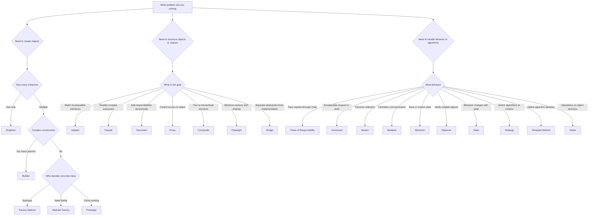

# RULE TO WORK WITH THIS REPO
# GoF Design Patterns Selection Flowchart (Mermaid)

```mermaid
flowchart TB
  Root[What problem are you solving]

  Root --> CreateQ{Need to create objects}
  Root --> StructureQ{Need to structure objects or classes}
  Root --> BehaviorQ{Need to handle behavior or algorithms}

  %% Creational
  CreateQ --> InstancesQ{How many instances}
  InstancesQ -->|One only| Singleton[Singleton]
  InstancesQ -->|Multiple| ComplexCtorQ{Complex construction}
  ComplexCtorQ -->|Yes many params| Builder[Builder]
  ComplexCtorQ -->|No| DecideClassQ{Who decides concrete class}
  DecideClassQ -->|Subclass| FactoryMethod[Factory Method]
  DecideClassQ -->|Need family| AbstractFactory[Abstract Factory]
  DecideClassQ -->|Clone existing| Prototype[Prototype]

  %% Structural
  StructureQ --> GoalQ{What is the goal}
  GoalQ -->|Match incompatible interfaces| Adapter[Adapter]
  GoalQ -->|Simplify complex subsystem| Facade[Facade]
  GoalQ -->|Add responsibilities dynamically| Decorator[Decorator]
  GoalQ -->|Control access to object| Proxy[Proxy]
  GoalQ -->|Tree or hierarchical structure| Composite[Composite]
  GoalQ -->|Minimize memory with sharing| Flyweight[Flyweight]
  GoalQ -->|Separate abstraction from implementation| Bridge[Bridge]

  %% Behavioral
  BehaviorQ --> BehaviorTypeQ{What behavior}
  BehaviorTypeQ -->|Pass request through chain| ChainOfResponsibility[Chain of Responsibility]
  BehaviorTypeQ -->|Encapsulate request or undo| Command[Command]
  BehaviorTypeQ -->|Traverse collection| Iterator[Iterator]
  BehaviorTypeQ -->|Centralize communication| Mediator[Mediator]
  BehaviorTypeQ -->|Save or restore state| Memento[Memento]
  BehaviorTypeQ -->|Notify multiple objects| Observer[Observer]
  BehaviorTypeQ -->|Behavior changes with state| State[State]
  BehaviorTypeQ -->|Switch algorithms at runtime| Strategy[Strategy]
  BehaviorTypeQ -->|Define algorithm skeleton| TemplateMethod[Template Method]
  BehaviorTypeQ -->|Operations on object structure| Visitor[Visitor]
```

