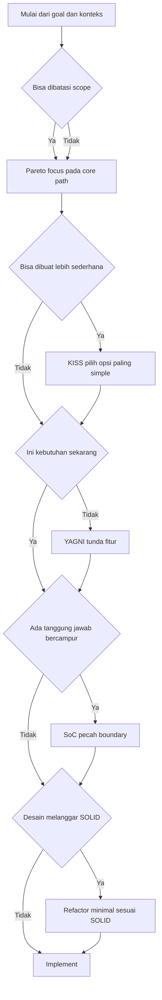
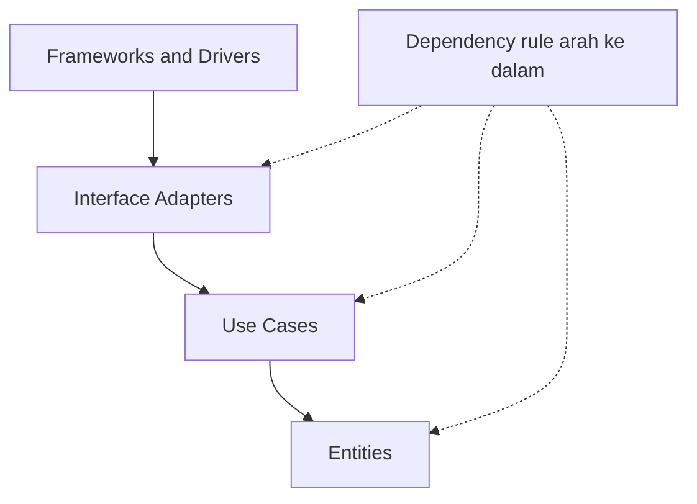
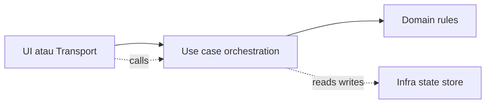
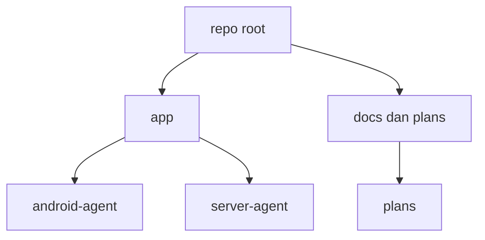
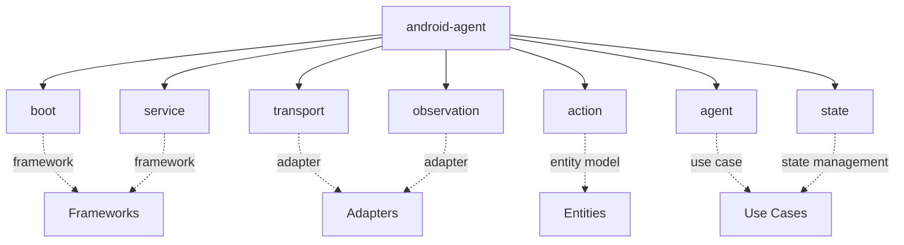
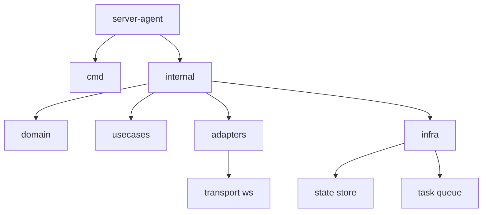
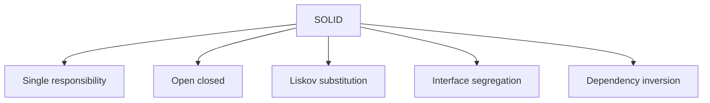

# RULE TO WORK WITH THIS REPO
# Prinsip Desain dan Clean Architecture

Dokumen ini berisi diagram Mermaid ringkas untuk:

- KISS
- YAGNI
- PARETO
- SOLID
- SOC
- Folder structure
- Clean Architecture

## 1. Decision flow prinsip saat desain

## 2. Clean Architecture dan arah dependency

Diagram ini menekankan aturan utama: dependency mengarah ke dalam.

## 3. SoC mapping ke layer

## 4. Folder structure yang selaras dengan Clean Architecture

### 4.1 Struktur repo level tinggi

### 4.2 android-agent sebagai execution edge

Mapping high-level ke layer Clean Architecture. Ini bukan kontrak wajib, hanya guideline agar boundary jelas.

### 4.3 server-agent sebagai control plane

Untuk server-agent yang belum diimplementasikan, struktur minimalis yang sering cukup:

## 5. SOLID ringkas sebagai checklist

