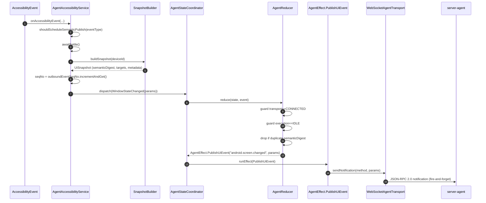

# android-agent

Android agent skeleton aligned to the ADR.

## Intent

This app is the execution edge, not the control plane.

It owns:

- boot startup
- accessibility-backed observation
- action dispatch
- transport connection to the control server

It does not own:

- workflow orchestration
- adapter-specific behavior for CLI, MCP, or AI SDK
- server truth about task lifecycle

## Package Layout

- `boot`
  - boot startup entrypoints
- `service`
  - accessibility service boundary
- `transport`
  - WebSocket / JSON-RPC transport boundary
- `observation`
  - local normalized UI models
- `action`
  - local action models

## Event-Driven Reconciliation Loop

`android-agent` proactively publishes semantic UI changes to the server using JSON-RPC 2.0 notifications over WebSocket.

Filtering rules in reducer:
- drop when transport is not `CONNECTED` or execution is not `IDLE`
- drop when `ui.semanticDigest` equals `lastPublishedUiDigest`
- otherwise publish `android.screen.changed` and update `lastPublishedUiDigest`
