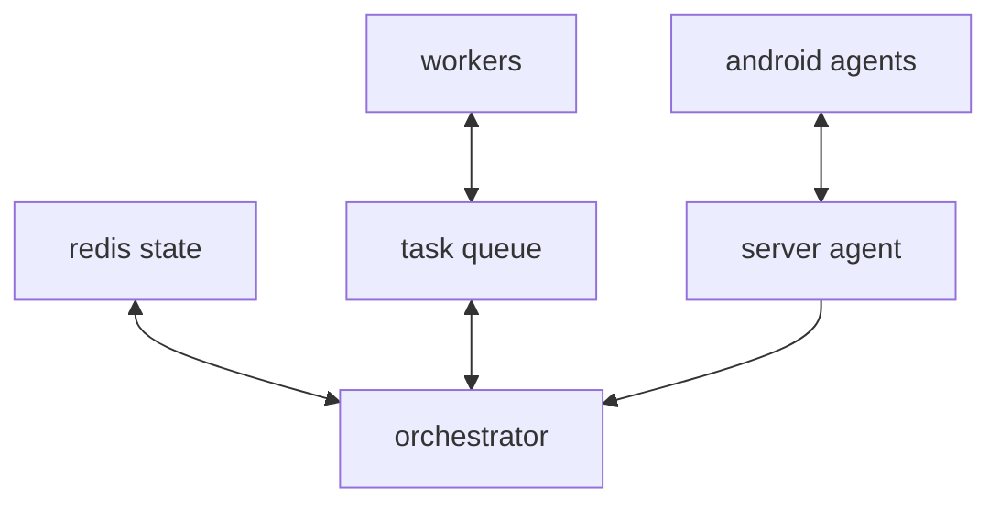
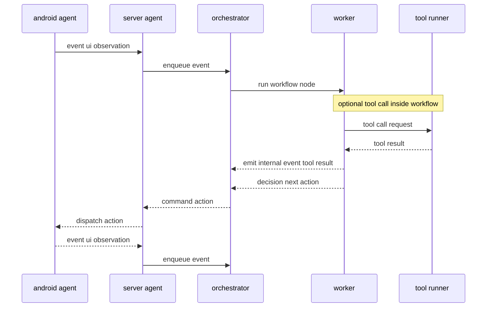

# Agents

Dokumen ini mendeskripsikan arsitektur tingkat tinggi untuk sistem agent event-driven.

- `android-agent` adalah execution edge.
- `server-agent` adalah control plane.

Repo terkait:

- android-agent intent: `app/android-agent/README.md`
- server-agent bahasa: `app/server-agent/CLAUDE.md`

## 1. TASKS

Task adalah unit kerja fundamental (fundamental unit of work) yang punya tujuan dan lifecycle.

Prinsip:

- Task dibuat dan dikelola di server-agent.
- android-agent mengeksekusi perintah untuk task, bukan mengorkestrasi.

## 2. WORKFLOW

Workflow adalah graf eksekusi untuk menjalankan Task secara event-driven.

Karakteristik:

- event-based: workflow bereaksi terhadap event dari android-agent
- argo-like: dipikirkan sebagai DAG (node dan edge), dengan branch berbasis kondisi

Konsep event-based workflow (tingkat tinggi):

- Workflow tidak berjalan sebagai loop polling di device; transisi langkah dipicu oleh event yang masuk.
- Sumber event utama:
  - observasi UI berbasis transisi (snapshot dan perubahan UI dari waktu ke waktu)
  - lifecycle agent (online, offline, capability)
- Orchestrator memproses event + state task saat ini, lalu:
  - memilih node berikutnya (branching)
  - mengeluarkan command action, atau request observasi tambahan
  - memperbarui state task agar langkah berikutnya deterministik dan bisa di-retry

Konsep graf:

- node: step logis (misal Observe, Decide, Act, Verify)
- edge: transisi antar node
- branch: pemilihan edge berdasarkan kondisi (event dan state task)

Node type (contoh, tingkat tinggi):

- Observe: minta atau proses observasi UI terbaru untuk sinkronisasi state.
- Decide: evaluasi `(event + state)` dan tentukan edge atau branch berikutnya.
- Act: keluarkan command action (tap, input, scroll) ke android-agent.
- ToolCall: panggil tool eksternal atau internal (misal LLM, search, policy checker, enrichment) untuk membantu keputusan di tengah workflow; hasilnya masuk kembali sebagai event internal.
- Verify: validasi hasil berdasarkan transisi UI dan update progress task.
- Resync: fallback untuk re-scan UI saat state drift atau event tidak konsisten.
- Terminal: node akhir saat goal tercapai atau task dibatalkan.

Controls and Policies (tingkat tinggi):

- Data flow: tiap node mengonsumsi `(event + state task)` dan menghasilkan output (misal keputusan branch, command action, atau request observasi). Output ini memperbarui state task.
- Input/output dan artifact: node dapat menghasilkan artifact konseptual (misal snapshot UI, log, atau trace) untuk audit dan debug.
- Delivery semantics: asumsikan event dan command bisa duplicated dan out-of-order (at-least-once). Orchestrator dan node handler perlu idempotent, serta punya dedup dan ordering strategy.
- Retry: kebijakan retry per node (maks attempt, backoff) dengan asumsi idempotency atau mekanisme dedup.
- Timeout: batas waktu per node/per action, serta deadline task secara keseluruhan.
- Error handling: klasifikasi error (retryable vs fatal) dan fallback path (misal kembali ke Observe untuk re-sync UI).
- Concurrency/parallelism: node dapat berjalan paralel (misal observe + telemetry), lalu join sebelum Decide; sertakan rate-limit per device.
- Cancellation/stop conditions: workflow bisa dibatalkan (manual/otomatis) saat tujuan tercapai, deadline lewat, atau kondisi safety terpenuhi.

Catatan: representasi workflow dalam YAML argo-like dimaksudkan sebagai konsep. Schema detail bukan scope dokumen ini.

Korelasi argo-like dengan event-based:

- Event dapat diperlakukan sebagai input parameter dan atau artifact konseptual yang menggerakkan eksekusi node pada DAG.
- Node seperti `Observe` menghasilkan artifact (snapshot UI) yang kemudian dipakai node berikutnya (misal `Decide` atau `Verify`).
- Branching diputuskan dari kombinasi `(event terbaru + state task + artifact sebelumnya)`, mirip pemilihan edge pada DAG.

Contoh ilustratif (argo-like YAML), hanya untuk menunjukkan bentuk DAG dan branching:

```yaml
apiVersion: argoproj.io/v1alpha1
kind: Workflow
metadata:
  generateName: agent-task-
spec:
  entrypoint: main
  templates:
    - name: main
      dag:
        tasks:
          - name: observe
            template: observe
          - name: decide
            dependencies: [observe]
            template: decide
          - name: act
            dependencies: [decide]
            when: "{{tasks.decide.outputs.parameters.next}} == act"
            template: act
          - name: verify
            dependencies: [act]
            template: verify
```

## 3. EVENT

Event adalah pesan dari android-agent ke server-agent untuk membantu server menentukan langkah berikutnya.

Selain event dari android-agent, control plane dapat menghasilkan event internal untuk melanjutkan workflow (misal `ToolResult` dari pemanggilan tool di tengah workflow).

Minimal, event observasi UI perlu membawa konteks:

- current UI snapshot
- atribut node yang berguna untuk keputusan: clickable, editable
- package name (identitas app di foreground)

### 3.1 UiObservation sebagai Snapshot dan Transisi

Karena workflow bersifat event-based, event `UiObservation` dipakai sebagai sumber kebenaran untuk memutuskan step berikutnya dan untuk menyimpulkan hasil action.

Prinsip:

- android-agent mengirim snapshot UI (umumnya tree node Accessibility) secara periodik atau ketika ada perubahan signifikan.
- server-agent dapat membandingkan snapshot saat ini dengan snapshot sebelumnya untuk mendeteksi transisi UI (misal navigasi screen, muncul dialog, fokus berpindah, atau perubahan isi form).
- Validasi sukses/gagal action lebih aman disimpulkan dari perubahan UI sesudah action, dibanding mengandalkan sinyal hasil action yang terpisah.

Contoh atribut node UI yang relevan (tingkat tinggi, tanpa schema):

- interaksi: `clickable`, `editable`, `enabled`, `focused`, `scrollable`
- identitas: text/label yang terlihat, resource id (jika ada), class name
- struktur: parent-child relation, index, depth, path
- geometri: bounds di layar

Catatan: untuk akurasi transisi, android-agent biasanya perlu mengirim snapshot yang cukup lengkap (bukan hanya node yang berubah), atau menyertakan indikator perubahan (misal hash snapshot atau sequence number) agar server bisa melakukan dedup dan ordering.

Kategori event (tingkat tinggi):

- AgentLifecycle: online, offline, heartbeat, capability
- UiObservation: snapshot UI, perubahan UI, error aksesibilitas
- ToolResult: hasil pemanggilan tool (internal event di server) untuk memperkaya konteks sebelum Decide

Catatan: status sukses/gagal action umumnya disimpulkan dari transisi UI berikutnya (post-action) dan bukan dari event ActionResult terpisah.

## 4. WORKER

Worker adalah proses long-running di infrastruktur server-side yang mengambil (pick up) dan mengeksekusi task (umumnya per node workflow).

- menerima event + state task
- memilih branch berikutnya
- menghasilkan command untuk android-agent atau request observasi tambahan

## 5. KOMPONEN

### 5.1 android-agent

Tanggung jawab utama (execution edge):

- boot startup
- accessibility-backed observation
- action dispatch
- transport connection ke server

Tidak bertanggung jawab atas:

- workflow orchestration
- source of truth lifecycle task

### 5.2 server-agent

Tanggung jawab utama (control plane):

- orkestrasi workflow
- penyimpanan state task
- routing command ke device
- menerima event (utamanya `UiObservation`) dan menentukan langkah berikutnya

Bahasa: Go.

## 6. DIAGRAM

### 6.1 Control-plane Topology (konseptual)



### 6.2 Event dan Action Loop



## 7. Supporting Multiple Android Agents / Multiple Devices

Scaling ke banyak device (masing-masing menjalankan android-agent) terutama butuh concurrency, isolasi state per device, dan komunikasi yang andal.

### 7.1 Agent Identification dan Connection Management

- Tiap device connect via WebSocket dan register dengan identifier unik (misal device id atau installation id).
- Server menyimpan connection registry yang memetakan `agent id -> koneksi` (in-memory atau Redis).
- Saat reconnect, server berusaha mempertahankan `agent id` yang sama untuk kontinuitas workflow.

### 7.2 Isolasi Workflow Instance per Device

- State eksekusi workflow harus per-agent (keyed by agent id).
- Definisi workflow bisa shared, tapi instance dan progress selalu per device.

### 7.3 Penyimpanan State Workflow

- Skala kecil: map in-memory pada server bisa cukup.
- Skala lebih besar atau butuh survive restart: simpan state di Redis (opsional TTL) agar memungkinkan horizontal scaling.

### 7.4 Event Ingestion dan Routing

- Semua agent mengirim event observasi UI (snapshot dan transisi UI) ke server.
- Server merutekan event ke workflow instance yang tepat berdasarkan agent id.
- Untuk distribusi, event bisa dipublish ke stream dan diproses worker secara terpisah.

### 7.5 Network Partitions dan Reconnection

- Implement heartbeat untuk mendeteksi koneksi stale.
- Saat agent offline, workflow bisa di-pause atau dibiarkan timeout sesuai policy.
- Saat reconnect, workflow dilanjutkan berdasarkan state terakhir; action harus idempotent atau punya dedup.

### 7.6 Task Queue untuk Resilience (Opsional)

- Command action bisa dikirim langsung lewat WebSocket.
- Alternatif: decouple command generation dari delivery via task queue.
- Jika agent offline, command tetap tersimpan di queue hingga agent online kembali.

### 7.7 Horizontal Scaling Server

- Gunakan load balancer untuk mendistribusikan koneksi WebSocket.
- Sticky session berbasis agent id mengurangi kebutuhan forwarding antar node.
- Jika state ada di Redis, beberapa node server bisa memproses agent yang berbeda dengan store yang sama.

### 7.8 Observability

- Logging dan metric harus menyertakan agent id dan task id untuk korelasi.
- Pantau status koneksi per agent, event rate, queue length, dan latency eksekusi workflow.

## 8. Robustness dan Resilience (Prinsip)

Tujuan bagian ini adalah memastikan sistem tetap aman dan bisa dipulihkan walaupun:

- agent sering reconnect
- event datang ganda atau tidak berurutan
- action outcome ambigu (bergantung transisi UI)
- server restart atau worker crash
- tool call di tengah workflow gagal atau lambat

### 8.1 Delivery Semantics

- Desain di atas asumsi at-least-once untuk event ingestion dan command delivery.
- Semua handler (node workflow) sebaiknya idempotent.

### 8.2 Ordering dan Dedup

- Gunakan monotonic sequence number per agent untuk snapshot UI dan event lifecycle.
- Orchestrator mengabaikan event yang lebih lama dari watermark terakhir.
- Dedup bisa berbasis `(agent id + sequence number)` atau fingerprint snapshot (hash).

### 8.3 Checkpointing dan Recovery

- Persist state workflow secara berkala atau setelah setiap transisi node agar bisa resume.
- Simpan artifact minimal yang diperlukan untuk determinisme (misal last UI snapshot hash, last node, last decision).
- Saat recovery, lakukan Observe atau Resync untuk menyelaraskan state dengan UI terkini.

### 8.4 Hardening ToolCall

- ToolCall wajib punya timeout.
- ToolCall failure sebaiknya diperlakukan sebagai event internal dan punya fallback path (misal lanjut tanpa enrichment atau kembali ke Observe).
- Pertimbangkan caching hasil tool untuk kasus deterministik agar mengurangi flakiness.

### 8.5 Backpressure dan Safety

- Rate limit event dan command per agent untuk menghindari overload.
- Tambahkan stop condition saat error berulang untuk mencegah loop tak berujung.
- Gunakan cancellation untuk menghentikan task saat kondisi safety terpenuhi.

## Adding a Domain Service (Model B)

Setiap domain service yang perlu dipanggil dari workflow mengikuti Model B:
service expose REST API untuk operator + tool protocol untuk workflow engine.

Tidak ada shared Go module antara server-agent dan domain services — protocol types
di-duplikasi per service secara intentional. Services tetap fully isolated.

### Checklist

1. **Scaffold service baru** — ikuti struktur `app/account-service/` atau `app/sms-service/`:
   - `cmd/server/main.go` + `config.go`
   - `internal/usecase/port.go` (interface)
   - `internal/handler/toolserver.go` (tool protocol)
   - `go.mod` (standalone module, tidak ada `go.work`)

2. **Implement tool protocol** — copy `internal/handler/toolserver.go` dari service yang sudah ada.
   File ini self-contained (tidak pull helper dari file lain). Ganti nama tool dan panggilan usecase.

3. **Wire di `main.go`**:
   ```go
   mux.Handle("/v1/tools",  toolHandler)
   mux.Handle("/v1/tools/", toolHandler)
   ```

4. **Register provider di server-agent** — tambah entry di `config/tools/providers.yaml`:
   ```yaml
   - id: <service>-http
     kind: http
     optional: true
     baseURLEnv: AUTO_<SERVICE>_URL
     timeout: 5s
   ```

5. **Tambah manifests** — satu file per tool di `config/tools/manifests/<service>.<tool>.yaml`:
   ```yaml
   name: <service>.<tool>
   providers:
     - provider: <service>-http
       providerToolName: <service>.<tool>
   ```

6. **Set env var** — `AUTO_<SERVICE>_URL=http://localhost:<port>`

### Protocol contract

- `GET /v1/tools` — discovery; returns array of tool descriptors (name, description, inputSchema, outputSchema)
- `POST /v1/tools/{name}:invoke` — invoke; body `{callId, params}`, response `{result}` or `{error: {code, message, retryable}}`

Server-agent client implementation: `internal/tools/catalog_loader.go` (HTTP provider kind).
Reference server implementation: `internal/tools/exampleprovider/handler.go` and `app/account-service/internal/handler/toolserver.go`.
