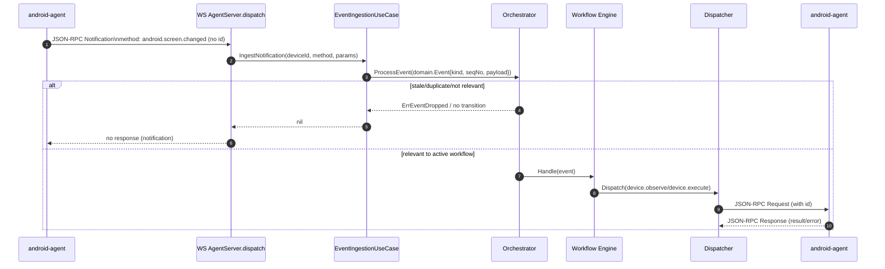

# server-agent

Go control plane for the **ppp** Android automation system. Orchestrates multi-step workflows across one or more Android devices connected via WebSocket.

## Overview

```
android-agent (device)  ──WS/JSON-RPC──►  server-agent (control plane)
                                              │
                          HTTP REST API ◄─────┤
                          POST /tasks         │  workflow engine
                          GET  /tasks/{id}    │  tool catalog
                          GET  /workflows     │  event runtime
                          GET  /metrics       │  state store
```

Two runtime layers:

- **android-agent** — Kotlin app on-device. Observes UI via accessibility, executes actions (tap, input, scroll, open app), streams events over WebSocket.
- **server-agent** — Go control plane. Accepts device connections, drives workflow DAG execution, manages task state, routes commands, invokes tools.

---

## Quick Start

```bash
# From app/server-agent/

go run ./cmd/server                                           # default :3000
go run ./cmd/server -config ./config/server.toml.example     # with config file
go run ./cmd/server -workflow-dir ./config/examples/workflows # load example workflows

# Create a task
curl -X POST http://localhost:3000/tasks \
  -H 'Content-Type: application/json' \
  -d '{"goal":"set private dns","deviceId":"<deviceId>","workflowName":"android-settings-private-dns","inputArtifacts":{"private_dns_hostname":"dns.quad9.net"}}'
```

---

## Build & Test

```bash
go build -o bin/server-agent ./cmd/server
go test ./...
go vet ./...
go mod tidy
```

---

## Package Layout

```
cmd/server/               Entry point — wires all components, starts HTTP server
  config.go               Config struct, TOML loading, env/flag override chain
  main.go                 Bootstrap: stores, runtimes, use cases, HTTP mux

internal/
  domain/                 Pure types — no side effects, no I/O
    event.go              Event, EventKind, acceptance semantics
    task.go               Task, TaskStatus
    workflowdef.go        WorkflowDef, StepDef, ActionDef, ToolCallDef, ExpectDef
    workflow.go           WorkflowState (execution checkpoint)
    command.go            Command, CommandResult, CommandKind
    snapshot.go           UiSnapshot, UiTarget (accessibility tree)

  registry/               In-memory device registry (DeviceID → Sender)
  store/                  TaskStore, WorkflowStateStore, EventPlaneStore, TaskQueue
                          — file-backed (default) and Redis implementations
  dispatcher/             Command routing + response correlation (inflight tracking)
  eventruntime/           Durable event acceptance — inline or Redis-Streams dispatch
  orchestrator/           Per-device event processor (mutex, dedup, engine, checkpoint)
  workflow/               Step-graph engine (trigger match, action/tool/routing, expect)
  tools/                  Startup-loaded tool catalog (providers, manifests, bindings)
  transport/ws/           WebSocket upgrade, JSON-RPC 2.0 framing, read loop
  handler/                HTTP handlers (task, workflow, event-plane, metrics, openapi)
  usecase/                Thin orchestration: task CRUD, lifecycle, assignment, recovery
  telemetry/              Prometheus metrics registry
```

**Dependency direction** (strictly inward):

```
transport/ws → handler → usecase → orchestrator → {store, workflow, dispatcher}
                                    workflow/Engine → {dispatcher, ToolInvoker}
                                                        ↓
                                                      registry → domain
```

---

## HTTP API

| Method | Path | Description |
|--------|------|-------------|
| `GET` | `/healthz` | Health check |
| `POST` | `/tasks` | Create task `{goal, deviceId?, workflowName?, inputArtifacts?}` |
| `GET` | `/tasks/{id}` | Get task status |
| `DELETE` | `/tasks/{id}` | Cancel task |
| `GET` | `/workflows` | List all workflow definitions |
| `GET` | `/workflows/{name}` | Get workflow definition (JSON) |
| `PUT` | `/workflows/{name}` | Store workflow definition (YAML body) |
| `GET` | `/events/accepted` | List accepted events (paginated) |
| `GET` | `/events/accepted/{id}` | Get accepted event detail |
| `POST` | `/events/accepted/{id}/replay` | Replay accepted event |
| `GET` | `/events/deadletters` | List dead letters (paginated) |
| `GET` | `/events/deadletters/{id}` | Get dead letter detail |
| `POST` | `/events/deadletters/{id}/replay` | Replay dead letter |
| `GET` | `/metrics` | Prometheus metrics |
| `GET` | `/openapi.json` | OpenAPI 3.1 spec |
| `GET` | `/swagger/` | Swagger UI |

List endpoints support: `limit`, `offset`, `cursor`, `order=asc\|desc`, `from`, `to` (RFC3339), and filters `deviceId`, `kind`, `source`.

---

## WebSocket Protocol (JSON-RPC 2.0)

**Endpoint:** `ws://<host>/ws/agent`

### Agent → Server

| Method | Params | Response |
|--------|--------|----------|
| `agent.hello` | `{deviceId, agentInstanceId, capabilities: [{name, available}]}` | `{sessionId}` |
| `agent.resume` | `{deviceId, sessionId, capabilities: [...]}` | `{sessionId}` |
| `agent.heartbeat` | `{deviceId, sessionId}` | — |
| `agent.disconnect` | `{deviceId, sessionId}` | — |
| `android.*` | `{seqNo, adbSerial?, serviceComponent?}` | — |

Android events: `android.activity.created`, `android.activity.resumed`, `android.screen.changed`, `android.notification`, `android.app.foreground`, `android.accessibility.disabled`.

### Server → Agent

| Method | Params | Returns |
|--------|--------|---------|
| `device.observe` | `{}` | `{snapshotBefore, snapshotAfter}` |
| `device.execute` | `{action: {...}}` | `{snapshotBefore, snapshotAfter, success}` |
| `device.query` | `{selector: {kind, value}}` | `{targets: [...]}` |
| `device.capabilities.get` | `{}` | `{capabilities: [...]}` |

### `android.screen.changed` Handling

For `android.*` notifications (including `android.screen.changed`), the server ingests the event and does not send a direct JSON-RPC response for notification frames (`id` absent).



Notes:
- Unknown non-`android.*` methods return JSON-RPC error `method not found`.
- `android.*` events from unregistered connections are dropped.

---

## Workflow YAML Schema

```yaml
name: my-workflow
version: 2
entry: step_id

steps:
  step_id:
    # Trigger: AND semantics; empty = activate immediately
    trigger:
      kind: android.window.state_changed   # optional
      package: com.example.app             # optional
      text_contains: "Settings"            # optional

    # Action (mutually exclusive with tool_call)
    action:
      kind: open_app | click | long_click | input_text | scroll | observe | fill_form
      package: com.example                 # open_app only
      target:
        kind: text | resource_id | content_description | class | coordinate
        value: "{{input.key}}"             # supports {{input.key}} interpolation
      input_text: "{{input.key}}"          # input_text only
      direction: up | down | left | right  # scroll only

    # Tool invocation (mutually exclusive with action)
    tool_call:
      tool_name: identity.generate_email
      optional: false                      # if true, continue on failure
      params:
        fullName: "{{input.full_name}}"
      outputs:
        email: profile_email               # result JSON key → artifact name

    # Expect: event that confirms the action succeeded
    expect:
      kind: android.window.state_changed
      package: com.android.settings
      text_contains: "Private DNS"

    on_success: next_step | terminal
    on_failure: fallback_step | terminal
    timeout: 10s                           # default 10s
    max_retry: 2                           # retries on timeout before on_failure
```

**Key semantics:**

- Empty `trigger: {}` — step auto-executes the moment it is reached (no waiting for next device event)
- `{{input.key}}` — interpolated from `WorkflowState.Inputs`, seeded from `task.inputArtifacts`
- `expect` with `timeout` — engine waits for the confirming event; if deadline passes, retries the action (up to `max_retry`), then follows `on_failure`
- `coordinate` target kind — absolute pixel coordinates `"x,y"`; empty value is a no-op (unused grid slots)

Load workflows at startup with `-workflow-dir <dir>`. YAML files are hot-reloaded via polling (`-workflow-poll`, default 5s).

---

## Tool Catalog

```
config/tools/
  providers.yaml          Provider declarations (kinds: builtin, http, openai, deepseek, anthropic, gemini)
  manifests/*.yaml        Tool definitions: name, provider, I/O schema, timeout
  bindings/*.yaml         Workflow-level: params template, artifact extraction, fallbacks
  prompts/                LLM prompt files (referenced from manifests)
```

### Supported Provider Kinds

| Kind | Description | Required Env Vars |
|------|-------------|-------------------|
| `builtin` | Local deterministic tools + generic LLM JSON execution | — |
| `http` | Remote provider (`GET /v1/tools`, `POST /v1/tools/{name}:invoke`) | `AUTO_TOOL_EXAMPLE_BASE_URL` |
| `openai` | OpenAI chat-completions with forced function calls | `AUTO_TOOL_OPENAI_API_KEY`, `AUTO_TOOL_OPENAI_MODEL` |
| `deepseek` | DeepSeek chat-completions with structured output | `AUTO_TOOL_DEEPSEEK_API_KEY`, `AUTO_TOOL_DEEPSEEK_MODEL` |
| `anthropic` | Anthropic Messages API with forced tool use | `AUTO_TOOL_ANTHROPIC_API_KEY`, `AUTO_TOOL_ANTHROPIC_MODEL` |
| `gemini` | Gemini `generateContent` with JSON response schema | *(configure via manifest)* |

Optional providers are silently disabled at startup when their env vars are unset.

### Built-in Tools

| Tool | Description |
|------|-------------|
| `captcha.squares_to_taps` | Converts 1-indexed grid squares → `"x,y"` tap coordinates (9 slots) |

---

## State Store

### File (default)

Zero dependencies. Data written to `./var/` (override with `-data-dir`).

```
var/
  tasks.json
  workflow_state/{taskId}_{deviceId}.json
  events/accepted/
  events/deadletters/
  queue.json
  command_outbox/
```

### Redis

Set `AUTO_STATE_STORE=redis`. All records stored as Hashes with optional TTL.

```
AUTO_STATE_STORE=redis
AUTO_REDIS_ADDR=localhost:6379
AUTO_REDIS_PASSWORD=secret
AUTO_REDIS_DB=0
AUTO_STATE_TTL=168h
```

---

## Event Runtime

### Inline (default)

Accept event → process immediately in-process. Zero infrastructure.

```
AUTO_EVENT_RUNTIME=inline
```

### Redis Streams

Accept event → publish to partitioned wakeup queues → worker goroutines consume. For multi-instance horizontal scale.

```
AUTO_EVENT_RUNTIME=redis-streams
AUTO_REDIS_ADDR=localhost:6379
AUTO_EVENT_BUS_PARTITIONS=8           # same deviceId always maps to same partition
AUTO_REDIS_GROUP=server-agent
AUTO_REDIS_CONSUMER_PREFIX=server-agent
AUTO_REDIS_INSTANCE_ID=              # stable worker id (auto-generated if empty)
AUTO_EVENT_BUS_LEASE_TTL=15s
AUTO_EVENT_BUS_PENDING_IDLE=45s
AUTO_EVENT_BUS_CLAIM_COUNT=16
AUTO_EVENT_BUS_OWNERSHIP_RETRY=500ms
```

Partition ownership is lease-based via `workflow.wakeup.pNN.owner` Redis keys. Each worker drains its own pending entries, then claims idle entries, then reads new.

---

## Configuration

Override chain (lowest → highest priority):

```
built-in defaults  →  -config file  →  env vars  →  CLI flags
```

### CLI Flags

```
-config <path>          Path to TOML config file (optional)
-addr <addr>            HTTP listen address (default :3000)
-data-dir <path>        Runtime data directory (default ./var)
-tool-dir <path>        Tool catalog directory (default ./config/tools)
-workflow-dir <path>    Workflow YAML directory (default: in-memory only)
-workflow-poll <dur>    Workflow reload interval (default 5s)
```

### All Environment Variables

| Variable | Default | Description |
|----------|---------|-------------|
| `AUTO_STATE_STORE` | `file` | Store driver: `file` or `redis` |
| `AUTO_REDIS_ADDR` | `localhost:6379` | Redis address |
| `AUTO_REDIS_PASSWORD` | — | Redis password (secret) |
| `AUTO_REDIS_DB` | `0` | Redis database number |
| `AUTO_STATE_TTL` | `0` | Redis state TTL (`0` = no expiry) |
| `AUTO_EVENT_RUNTIME` | `inline` | Event runtime: `inline` or `redis-streams` |
| `AUTO_EVENT_BUS_PARTITIONS` | `8` | Wakeup stream partition count |
| `AUTO_REDIS_GROUP` | `server-agent` | Redis consumer group |
| `AUTO_REDIS_CONSUMER_PREFIX` | `server-agent` | Consumer ID prefix |
| `AUTO_REDIS_INSTANCE_ID` | — | Stable worker identity (auto-generated if empty) |
| `AUTO_EVENT_BUS_LEASE_TTL` | `15s` | Partition ownership lease TTL |
| `AUTO_EVENT_BUS_PENDING_IDLE` | `45s` | Idle time before XAUTOCLAIM |
| `AUTO_EVENT_BUS_CLAIM_COUNT` | `16` | Pending entries per XAUTOCLAIM call |
| `AUTO_EVENT_BUS_OWNERSHIP_RETRY` | `500ms` | Partition ownership retry backoff |
| `AUTO_ADB_SERVER_HOST` | `localhost` | ADB server host |
| `AUTO_ADB_SERVER_PORT` | `5037` | ADB server port |
| `AUTO_AGENT_ACCESSIBILITY_COMPONENT` | `com.autosdk.agent/...AgentAccessibilityService` | Accessibility service component |
| `AUTO_ADB_SERIAL_BY_DEVICE` | — | `deviceId=serial,deviceId=serial` mapping |
| `AUTO_TOOL_LLM_API_URL` | — | OpenAI-compatible LLM endpoint |
| `AUTO_TOOL_LLM_API_KEY` | — | LLM API key (secret) |
| `AUTO_TOOL_LLM_MODEL` | — | LLM model name |
| `AUTO_TOOL_OPENAI_API_KEY` | — | OpenAI API key (secret) |
| `AUTO_TOOL_OPENAI_MODEL` | — | OpenAI model |
| `AUTO_TOOL_DEEPSEEK_API_KEY` | — | DeepSeek API key (secret) |
| `AUTO_TOOL_DEEPSEEK_MODEL` | — | DeepSeek model |
| `AUTO_TOOL_ANTHROPIC_API_KEY` | — | Anthropic API key (secret) |
| `AUTO_TOOL_ANTHROPIC_MODEL` | — | Anthropic model |
| `AUTO_TOOL_EXAMPLE_BASE_URL` | — | Example HTTP provider base URL |

See `config/server.toml.example` for the annotated TOML reference.

---

## Observability

Prometheus metrics at `GET /metrics`:

| Metric | Type | Description |
|--------|------|-------------|
| `autosdk_server_device_lane_active` | Gauge | Active device workflow lanes |
| `autosdk_server_command_inflight` | Gauge | In-flight device commands |
| `autosdk_server_command_timeout_total{kind}` | Counter | Command timeouts by kind |
| `autosdk_server_event_ingest_lag_seconds{source}` | Histogram | Event processing lag |
| `autosdk_server_workflow_node_duration_seconds{node,outcome}` | Histogram | Workflow step latency |
| `autosdk_server_tool_call_duration_seconds{tool,outcome}` | Histogram | Tool invocation latency |
| `autosdk_server_command_duration_seconds{kind,outcome}` | Histogram | Command round-trip latency |
| `autosdk_server_workflow_wakeup_queue_depth` | Gauge | Redis wakeup queue depth (redis-streams only) |
| `autosdk_server_workflow_wakeup_partition_depth{partition}` | Gauge | Per-partition queue depth |
| `autosdk_server_event_replay_total{path,outcome}` | Counter | Event replay outcomes |
| `autosdk_server_wakeup_publish_fallback_total{path}` | Counter | Wakeup publish fallback triggers |
| `autosdk_server_redis_partition_lease_lost_total` | Counter | Partition lease losses |

---

## Shipped Workflows

| Workflow | Inputs | Description |
|----------|--------|-------------|
| `android-settings-private-dns` | `private_dns_hostname` | Navigates Settings → Network → Private DNS → sets hostname |
| `captcha-solve` | `screenshot_base64`, `grid_bounds`, `captcha_target`, `cols?` | LLM-based grid CAPTCHA solver with coordinate taps |
| `local-identity-profile` | — | Generates identity (name, email, password) via tool calls |
| `local-identity-welcome-email` | — | Generates welcome email (with LLM fallback) |

Workflows are data-driven YAML — no Go code needed for new workflows.

---

## Runtime Recovery

On startup, `RuntimeRecovery` scans persisted tasks and:

1. **Bootstraps** missing workflow state for assigned non-terminal tasks
2. **Reconciles** terminal workflow state back to task status (completed/failed)
3. **Requeues** pending tasks that lost their device assignment

Bootstrapped checkpoints carry `recovery_bootstrap=true` artifact for observability.

---

## Extending

**New workflow:** Add YAML under `-workflow-dir`. No Go code needed. See `config/examples/workflows/` for reference.

**New tool:** Add `config/tools/manifests/<tool>.yaml` (and optional binding + prompt). Supported provider kinds: `builtin`, `http`, `openai`, `deepseek`, `anthropic`, `gemini`.

**New action kind:** Add constant to `internal/domain/workflowdef.go`. Wire the action → command mapping in `internal/workflow/command.go`. Handle the command in android-agent's `ActionExecutor`.

**New agent JSON-RPC method:** Add case in `internal/transport/ws/server.go`, add handler in `internal/handler/agent.go`.

**Redis store:** Already implemented — set `AUTO_STATE_STORE=redis`.
