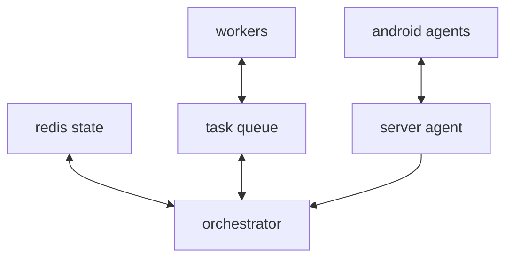
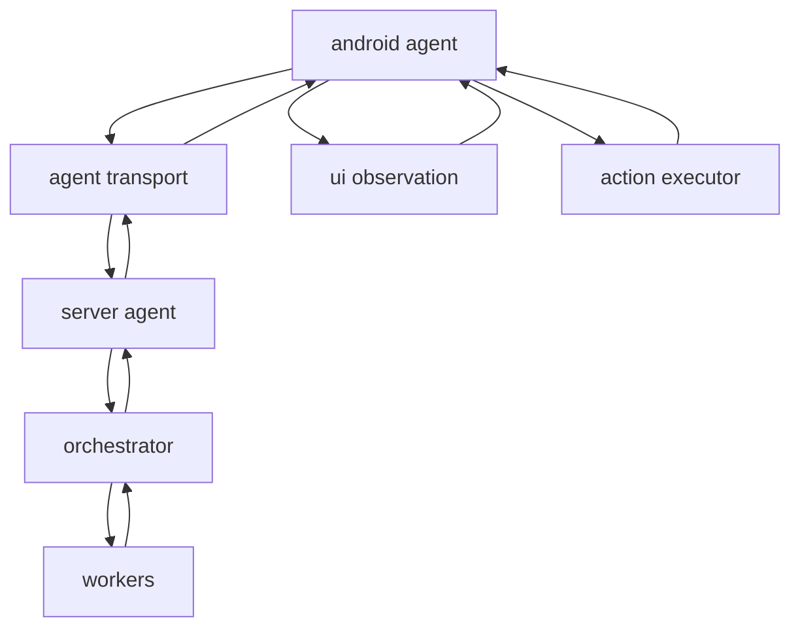
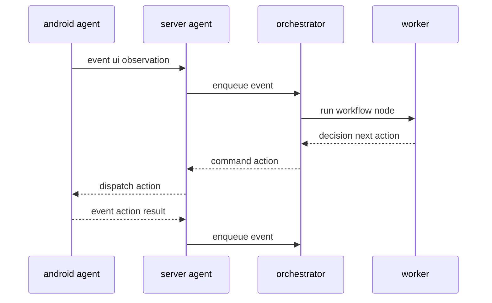

# Draft Arsitektur Tingkat Tinggi: Agents (android-agent + server-agent)

Dokumen ini adalah draft untuk merapikan isi [`AGENTS.md`](../AGENTS.md) menjadi arsitektur tingkat tinggi: komponen, boundary tanggung jawab, dan alur event-driven. Detail schema (JSON/YAML) sengaja tidak ditentukan.

Referensi repo:

- Intent android-agent ada di [`app/android-agent/README.md`](../app/android-agent/README.md)
- Server agent ditandai Go di [`app/server-agent/CLAUDE.md`](../app/server-agent/CLAUDE.md)
- Transport default WS URL ada di [`app/android-agent/app/build.gradle.kts`](../app/android-agent/app/build.gradle.kts)
- Contoh boundary action di [`app/android-agent/app/src/main/java/com/autosdk/agent/action/AutomationAction.kt`](../app/android-agent/app/src/main/java/com/autosdk/agent/action/AutomationAction.kt)

## 1. Tujuan

- Mendefinisikan pembagian peran antara execution edge dan control plane.
- Menjelaskan alur event-driven dari observasi UI hingga eksekusi action dan hasilnya.
- Menetapkan vocabulary: Task, Workflow, Event, Worker.

## 2. Non-goals

- Tidak menetapkan schema detail untuk event payload, workflow YAML, atau kontrak JSON-RPC.
- Tidak menetapkan pilihan infra produksi (deployment, auth provider, persistence, dsb).

## 3. Komponen dan Boundary

### 3.1 android-agent (Execution Edge)

Berdasarkan [`app/android-agent/README.md`](../app/android-agent/README.md), android-agent adalah aplikasi Android yang:

- Memulai runtime saat boot.
- Melakukan observasi UI via Accessibility.
- Menjalankan action lokal (tap, input, scroll, dsb).
- Menjaga koneksi transport ke control server.

Yang **tidak** dimiliki android-agent:

- Orkestrasi workflow.
- Kebenaran lifecycle task (source of truth).

Area kode yang mengindikasikan boundary:

- Observation: [`app/android-agent/app/src/main/java/com/autosdk/agent/observation/UiSnapshot.kt`](../app/android-agent/app/src/main/java/com/autosdk/agent/observation/UiSnapshot.kt)
- Accessibility boundary: [`app/android-agent/app/src/main/java/com/autosdk/agent/service/AgentAccessibilityService.kt`](../app/android-agent/app/src/main/java/com/autosdk/agent/service/AgentAccessibilityService.kt)
- Action model: [`app/android-agent/app/src/main/java/com/autosdk/agent/action/AutomationAction.kt`](../app/android-agent/app/src/main/java/com/autosdk/agent/action/AutomationAction.kt)
- Transport boundary: [`app/android-agent/app/src/main/java/com/autosdk/agent/transport/AgentTransport.kt`](../app/android-agent/app/src/main/java/com/autosdk/agent/transport/AgentTransport.kt) dan [`app/android-agent/app/src/main/java/com/autosdk/agent/transport/WebSocketAgentTransport.kt`](../app/android-agent/app/src/main/java/com/autosdk/agent/transport/WebSocketAgentTransport.kt)

### 3.2 server-agent (Control Plane)

server-agent adalah service (Go) yang:

- Menjadi sumber kebenaran task lifecycle.
- Memegang orkestrasi workflow (node, edge, branch).
- Menerima event dari android-agent dan memutuskan langkah berikutnya.
- Menghasilkan perintah action dan memproses action result.

Catatan: repo saat ini hanya menandai bahasa di [`app/server-agent/CLAUDE.md`](../app/server-agent/CLAUDE.md), jadi detail implementasi belum ada.

## 4. Konsep Data Model Tingkat Tinggi

### 4.1 Task

Unit kerja yang punya state dan tujuan.

- Diciptakan di server-agent.
- Di-assign ke satu atau lebih android-agent.

### 4.2 Workflow

Graf eksekusi task.

- Node merepresentasikan step logis (misal Observe, Decide, Act, Verify).
- Edge merepresentasikan transisi berdasarkan kondisi.
- Branch merepresentasikan pemilihan edge berdasarkan event dan state.

### 4.3 Event

Pesan dari android-agent ke server-agent yang menggambarkan kondisi eksekusi.

Kategori event yang biasanya diperlukan (tanpa schema detail):

- AgentLifecycle: online, offline, capability, heartbeat
- UiObservation: snapshot UI, perubahan UI, error aksesibilitas
- ActionResult: sukses, gagal, partial, retryable
- Telemetry: latency, resource usage, logs

### 4.4 Worker

Komponen server-side untuk mengeksekusi node workflow.

- Bisa synchronous (inline) atau asynchronous (queued).
- Menghasilkan command untuk android-agent, atau keputusan branch.

## 5. Alur Event-driven End-to-end

### 5.0 Control-plane Topology (Konseptual)

Berikut adaptasi dari sketsa kamu menjadi diagram yang lebih eksplisit untuk control plane. Ini tetap konseptual (tanpa keputusan produk/infra final).

### 5.1 Component View

### 5.2 Sequence View

## 6. Reliability dan Idempotency (Prinsip)

Tanpa menetapkan detail protokol, prinsip minimal:

- Event dan command sebaiknya punya correlation id untuk tracing.
- Action dispatch harus idempotent atau memiliki dedup strategy.
- Retry dilakukan di boundary yang jelas (transport vs orchestrator vs worker).

## 7. Observability (Prinsip)

- Log berstruktur di server-agent: task id, agent id, workflow node, decision.
- Metric: event rate, action latency, failure rate.

## 8. Saran Struktur `AGENTS.md`

Mengubah [`AGENTS.md`](../AGENTS.md) agar berurutan:

1. TASKS
2. WORKFLOW
3. EVENT
4. WORKER
5. Komponen: android-agent dan server-agent
6. Diagram Mermaid
