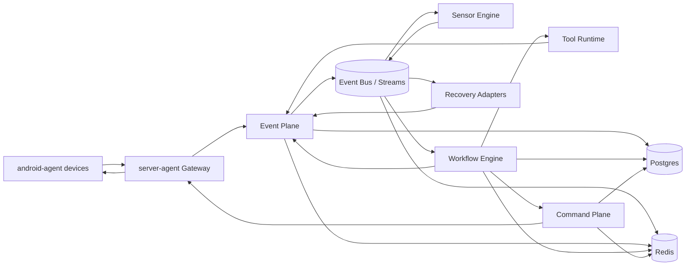
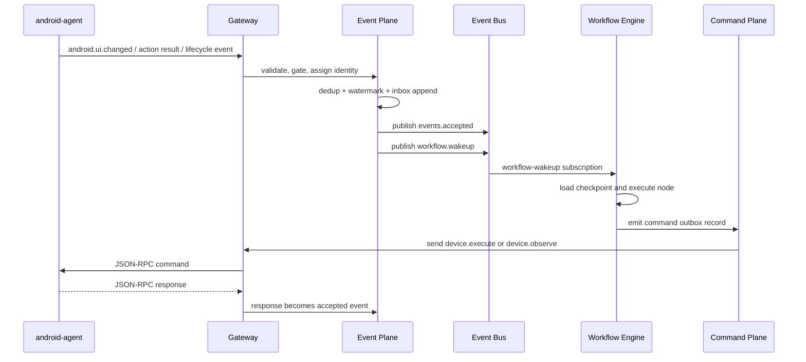
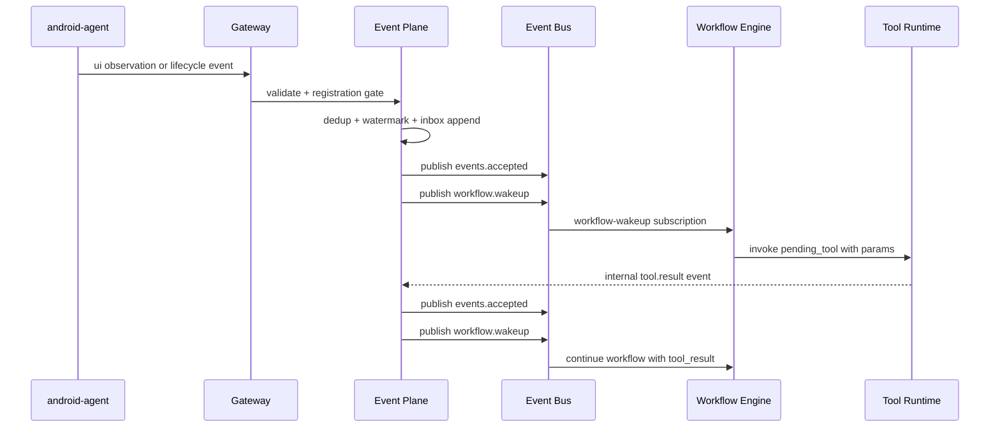
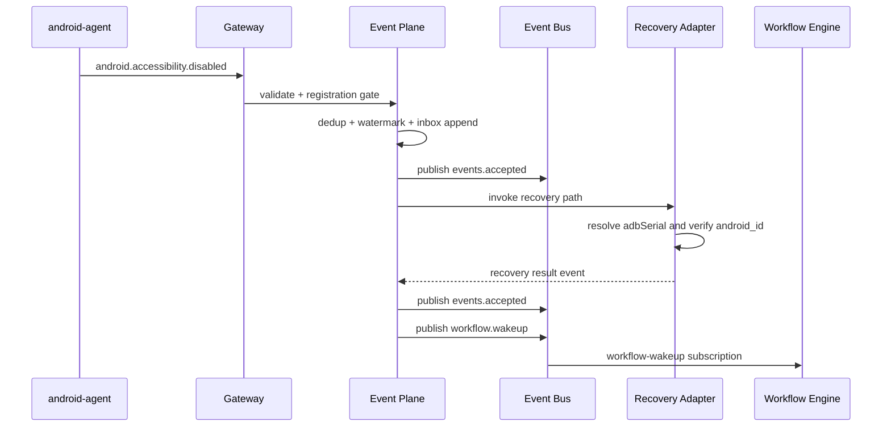

# Event-Driven Workflow Automation v2

Argo Events-like and Argo Workflows-like architecture for `android-agent` and `server-agent`.

Status: proposed  
Scope: architecture and execution model for robust workflow automation across 10+ Android devices  
Audience: repo maintainers implementing the next control-plane phases

## 1. Why v2

The earlier Argo-like sketch was directionally correct:

- separate event intake from workflow execution
- treat workflows as graph/state-machine execution, not ad hoc request handling
- preserve per-device ordering
- make retries, checkpoints, and recovery explicit

The weak point was not the model. The weak point was the level of abstraction. A generic "event bus + workers + orchestrator" story is easy to agree with and easy to misbuild.

For this repo, v2 narrows the design to what is actually needed:

- `android-agent` stays an execution edge only
- `server-agent` remains the control plane and workflow source of truth
- Argo-like means internal semantics, not importing Argo or rebuilding Kubernetes CRDs
- durability, deduplication, and ordering are first-class runtime requirements, not later hardening
- the first production shape is a modular monolith with durable stores, not a microservice mesh

## 2. Review of the Earlier Plan

### Keep

- event-driven control plane
- explicit workflow engine instead of embedding workflow logic inside transport handlers
- per-device ordering lanes
- durable dedup and watermark tracking
- clear split between event plane, workflow engine, and command plane
- external worker seam so execution can scale horizontally later

### Change

- start as one `server-agent` deployment with internal modules, not multiple services
- use `Postgres` as system-of-record and `Redis` as queue/cache/lock layer
- make event pub/sub explicit: the `Event Plane` owns a logical `Event Bus`
- treat `deviceId` as canonical identity and `adbSerial` as transport locator only
- run side effects only after event acceptance, never during raw ingestion
- keep workflow templates simple and versioned in storage before attempting a user-facing DSL

### Reject

- using `adbSerial`, device name, or model name as canonical device identity
- letting Redis be the only source of truth for workflow state
- firing recovery side effects before dedup/watermark acceptance
- allowing `android.*` events before `agent.hello` or `agent.resume`
- splitting gateway, orchestrator, scheduler, and workers into separate deployables for a 10-device problem

### Current Gaps to Close

- the v2 doc under-specified the existing `ToolCall` path even though the workspace already has `NodeKindToolCall`, `ToolRegistry`, and `tool.result` concepts
- the plan did not distinguish device commands from server-side tool calls; `device.*` goes to `android-agent`, but `toolcall` stays inside `server-agent`
- the plan treated all tools as one class; that is too coarse. Deterministic generators such as `identity.generate_indonesian_name`, `identity.generate_email`, `credential.generate_password`, and `identity.generate_birth_date` should stay local and schema-bounded, while LangGraph or LLM-backed tools should be used only where non-deterministic language reasoning is actually needed
- Phases 1, 2, 2.5, and the catalog-backed Phase 3 are now implemented in code: the workspace has a fail-closed manifest-backed registry, startup-loaded tool manifests and bindings under `config/tools`, local deterministic tool implementations, config-only prompt-backed model tools, a shipped reference `http` provider example under `cmd/tool-provider-example` plus `config/examples/http-provider`, that same remote manifest carried in the default catalog behind an optional provider gate, and shipped workflow paths that seed and consume `pending_tool_binding` end-to-end; the next gaps are durable event-plane persistence and scale-out hardening
- the roadmap lacked end-of-phase workspace state rules; without them, the repo can accumulate dead queues, placeholder adapters, and half-wired interfaces

## 3. Goals

- robust execution across 10+ concurrently connected Android devices
- resilience to reconnects, duplicate events, out-of-order delivery, worker crashes, and transient ADB failures
- predictable scaling to 50 to 200 devices without redesigning the control-plane model
- strict boundary between execution edge and control plane
- observability sufficient to debug a stuck task or a broken device lane quickly

## 4. Non-Goals

- full Argo compatibility
- Kubernetes-native CRD/operator architecture
- exactly-once delivery guarantees
- multi-region active-active control plane
- a general-purpose workflow DSL in the first implementation

## 5. Design Principles

### 5.1 Canonical Identity vs Transport Identity

- `deviceId` is the canonical identity. For Android, this is the stable device identifier already used by the server as the logical device key.
- `sessionId` identifies a transport session, not a device.
- `adbSerial` is only the current ADB route to a device. It can be a USB serial, emulator serial, or `ip:port`.
- device name and model are metadata only.

This is non-negotiable. If canonical identity and transport identity are mixed, the system will eventually mutate the wrong device.

### 5.2 Durable Write Before Effect

Incoming events must be durably accepted or durably dropped before any side effect happens.

Required order:

1. validate envelope
2. check registration/session rules
3. dedup and watermark decision
4. persist accepted event and workflow checkpoint
5. only then run side effects or emit commands

### 5.3 Per-Device Serialized Control

One device may run many observations over time, but the control plane must still have a single ordered mutation lane per device.

- commands that mutate UI state are serialized per `deviceId`
- workflow transitions that depend on device state are serialized per `deviceId`
- parallelism exists across devices, not inside a single device mutation lane

### 5.4 Recovery Prefers Re-Observation Over Assumption

The system should recover by observing fresh device state, not by trusting stale in-memory assumptions.

- reconnect -> resume session or hello -> resync state
- worker crash -> reload checkpoint -> observe/resync node
- ADB recovery uncertainty -> verify `android_id` before mutation

### 5.5 Argo-Like Semantics, Repo-Aligned Implementation

The conceptual model is:

- Argo Events-like: `EventSource -> Sensor -> Trigger`
- Argo Workflows-like: `WorkflowTemplate -> WorkflowRun -> NodeRunner -> Next Node`

The implementation stays inside `server-agent` packages and uses ports/adapters already present in the repo.

## 6. Target Topology

The recommended deployment for the next phase is a modular monolith plus durable infra.



### Recommended runtime shape

- `server-agent` binary exposes WebSocket and HTTP
- workflow workers run in the same process initially
- optional worker-only process can be introduced later without changing workflow semantics
- `Postgres` stores durable state
- `Redis` handles consumer groups, hot queues, short-lived leases, and rate limits

For 10 to 30 devices, this is enough. It is also the correct foundation for 100+ devices.

The `Event Bus` is drawn separately because it is the pub/sub seam. In phase 1 it can be implemented in-process after durable inbox append. In later phases the same seam is backed by Redis Streams consumer groups.

## 7. Logical Components

### 7.1 Gateway

Owns:

- WebSocket upgrade and JSON-RPC framing
- `agent.hello`, `agent.resume`, `agent.heartbeat`, `agent.disconnect`
- connection/session registry
- command response correlation handoff

Does not own:

- workflow decisions
- dedup/watermark logic
- task lifecycle

Repo mapping:

- `app/server-agent/internal/transport/ws`
- `app/server-agent/internal/handler`
- `app/server-agent/internal/registry`

### 7.2 Event Plane

Owns:

- event validation
- registration gate
- deterministic event identity
- deduplication and watermark tracking
- durable inbox append
- publish of accepted events into the event bus
- routing accepted events to subscribers
- dead-letter publish for unrecoverable events

Repo mapping:

- `app/server-agent/internal/usecase/event_ingestion.go`
- `app/server-agent/internal/orchestrator`
- `app/server-agent/internal/store`
- `app/server-agent/internal/domain/event.go`

Pub/sub boundary:

- the logical event pub/sub layer lives inside the `Event Plane`
- phase 1: in-process publish/subscribe after durable write
- phase 2+: the same boundary is implemented with Redis Streams consumer groups

Publishers:

- `Event Plane` after event validation and acceptance
- `Sensor Engine` for workflow wake triggers
- `Workflow Engine` for internal timeout, retry, or resync events
- `Recovery Adapters` for recovery result events

Subscribers:

- `Sensor Engine`
- `Workflow Engine`
- recovery subscribers
- dead-letter and observability consumers

### 7.3 Sensor Engine

Owns:

- filtering incoming events by workflow subscriptions
- deciding whether an event should create, wake, resume, or ignore a workflow run
- translating accepted events into workflow execution triggers

This is the Argo Events-like layer. It should stay small and deterministic.

### 7.4 Workflow Engine

Owns:

- workflow template lookup
- workflow run creation
- node execution state machine
- checkpoint persistence
- retries and timeout transitions
- branching rules

This is the Argo Workflows-like layer.

Repo mapping:

- `app/server-agent/internal/workflow`
- `app/server-agent/internal/orchestrator`
- `app/server-agent/internal/store`

#### 7.4.1 Tool Runtime

`ToolCall` is a workflow node executed inside the workflow engine through a `ToolRegistry` adapter boundary.

Rules:

- tool calls are server-side capabilities, not `device.*` commands
- tool calls may return artifacts directly and may also emit internal `tool.result` events back into the event plane
- the workflow definition remains the source of truth for when a tool is invoked and how failure branches are handled

Tool classes:

- deterministic local tools: `identity.generate_indonesian_name`, `identity.generate_email`, `credential.generate_password`, `identity.generate_birth_date`
- model-backed tools: LangGraph or LLM adapters for enrichment, classification, or language generation when deterministic logic is not enough

Design constraints:

- do not force deterministic generators through LangGraph or LLMs
- every tool must declare input schema, output schema, timeout, and fallback behavior
- production wiring must fail closed for unsupported tools; no silent noop success path

Repo mapping:

- `app/server-agent/internal/workflow/nodes/toolcall.go`
- `app/server-agent/internal/domain/workflow.go`
- `app/server-agent/internal/domain/event.go`

### 7.5 Command Plane

Owns:

- turning workflow node output into `device.*` commands
- per-device serialization
- command outbox
- inflight correlation and timeout tracking
- retry and dead-letter policy for commands

Repo mapping:

- `app/server-agent/internal/dispatcher`
- `app/server-agent/internal/registry`
- `app/server-agent/internal/domain/command.go`

### 7.6 Recovery Adapter Plane

Owns:

- ADB-based recovery actions such as re-enabling accessibility
- device identity verification before mutation
- bounded retries with explicit failure reason

This must remain an adapter, not a core workflow primitive.

### 7.7 Observability

Owns:

- structured logs with `deviceId`, `sessionId`, `taskId`, `workflowRunId`, `nodeId`, `commandId`, `eventId`
- metrics for intake lag, queue depth, workflow latency, command timeout rate, and per-device lane saturation
- traceability from incoming device event to final workflow outcome

## 8. Canonical Runtime Model

### 8.1 EventSource

An `EventSource` is any producer of events into the event plane:

- `android.*` notifications from devices
- command results from device RPC responses
- internal timers such as workflow timeout or retry deadline
- lifecycle transitions such as device online or offline

### 8.2 Event Bus

The `Event Bus` is the publish/subscribe seam inside the `Event Plane`.

It is a logical component, not a separate service in phase 1.

Named channels or streams:

- `events.accepted`: append-only audit mirror of accepted external and internal events
- `workflow.wakeup`: workflow create, resume, or wake triggers; this is the execution stream consumed by workers
- `events.deadletter`: malformed, exhausted, or unrecoverable events kept for operator inspection and replay

Publisher and subscriber rules:

- `Event Plane` publishes `events.accepted` only after durable acceptance
- current implementation publishes `workflow.wakeup` directly after durable acceptance or accepted-event replay; it does not consume `events.accepted` to drive workflow execution
- `Workflow Engine` subscribes to `workflow.wakeup`
- `events.accepted` is consumed by operators or future export or analytics integrations, not by the control-flow runtime
- dead-letter operators consume `events.deadletter` through inspection and replay tooling

Implementation phases:

- phase 1: in-process event acceptance and wakeup dispatch after durable inbox append
- phase 2+: Redis Streams consumer groups back the named channels

### 8.3 Sensor

A `Sensor` listens to accepted events and decides whether to:

- create a workflow run
- wake an existing workflow run
- ignore the event
- emit a compensating internal event

Sensors must be deterministic and side-effect free except for publishing the next internal trigger.

### 8.4 WorkflowTemplate

A versioned template that defines:

- node set
- edge/branch conditions
- retry and timeout policy
- compensation and terminal behavior

The first implementation should store templates as Go-backed definitions or simple persisted graphs. A user-authored workflow DSL can come later.

### 8.5 WorkflowRun

A durable instance keyed by a task and a device context.

Minimum fields:

- `workflowRunId`
- `taskId`
- `deviceId`
- `templateVersion`
- `status`
- `currentNode`
- `lastAcceptedEventId`
- `attempt`
- `checkpoint`
- `updatedAt`

### 8.6 NodeRunner

Each node type implements a narrow contract:

- input: prior checkpoint plus accepted event context
- output: next checkpoint plus command emission or branch decision

Recommended first node set:

- `Observe`
- `Query`
- `Decide`
- `Execute`
- `Verify`
- `Wait`
- `Recover`
- `Resync`
- `Terminal`

#### 8.6.1 ToolCall Node

The `ToolCall` node is the bridge between workflow state and server-side tool execution.

Minimum contract:

- prefers `pending_tool_binding` from workflow artifacts and still supports legacy `pending_tool` plus `pending_tool_params`
- invokes `ToolRegistry`
- writes `tool_result` back into workflow artifacts
- may emit an internal `tool.result` event when downstream logic should re-enter the normal event path

Execution rules:

- deterministic tools should be preferred for generated identity data such as Indonesian names, email composition, passwords, and birth dates
- LangGraph or LLM-backed tools are optional adapters behind the same registry, not a different orchestration model
- tool outputs must be JSON-schema validated before they are committed to artifacts
- tool calls must define timeout, retry policy, cacheability, and failure branch

### 8.7 Command

A command is a workflow-driven device request with durable correlation.

Minimum fields:

- `commandId`
- `workflowRunId`
- `taskId`
- `deviceId`
- `kind`
- `params`
- `attempt`
- `deadline`
- `idempotencyKey`

## 9. Canonical Data Contracts

### 9.1 Event Envelope

Minimum fields for any event entering the control plane:

| Field | Meaning |
|---|---|
| `eventId` | Deterministic ID, usually `deviceId:seqNo` when `seqNo > 0` |
| `kind` | Event kind such as `android.accessibility.disabled` |
| `deviceId` | Canonical device identity |
| `sessionId` | Transport session if available |
| `seqNo` | Monotonic device-side sequence number when applicable |
| `occurredAt` | Producer timestamp |
| `receivedAt` | Gateway receive timestamp |
| `payload` | Event-specific body |
| `source` | `device`, `workflow`, `timer`, `system` |

Rules:

- `eventId` must be deterministic
- missing or zero `seqNo` is allowed only when the source cannot provide it
- workflow side effects must not depend on non-durable ad hoc timestamps

### 9.2 Device Binding

Durable mapping between canonical device identity and transport details.

| Field | Meaning |
|---|---|
| `deviceId` | Canonical device identity |
| `lastSessionId` | Last successful logical session |
| `lastSeenAt` | Latest heartbeat or accepted event |
| `lastKnownAdbSerial` | Last verified ADB route |
| `adbVerifiedAt` | When `android_id` was last verified for that route |
| `metadata` | model, name, app version, capabilities |

### 9.3 Workflow Run

| Field | Meaning |
|---|---|
| `workflowRunId` | Durable run key |
| `taskId` | Owning task |
| `deviceId` | Device lane |
| `status` | queued, running, waiting, failed, completed |
| `currentNode` | Current node name |
| `checkpoint` | Opaque serialized node state |
| `version` | Optimistic concurrency/version |
| `updatedAt` | Last mutation timestamp |

### 9.4 Command Outbox Record

| Field | Meaning |
|---|---|
| `commandId` | Unique command identifier |
| `deviceId` | Target device |
| `workflowRunId` | Owning workflow |
| `payload` | JSON-RPC request body |
| `status` | pending, sent, acked, failed, dead-letter |
| `attempt` | Send attempt counter |
| `nextAttemptAt` | Retry scheduling point |

## 10. Reliability and Resilience Model

### 10.1 Delivery Semantics

The system should target:

- at-least-once event delivery into the event plane
- effectively-once workflow transition per accepted event
- at-least-once command dispatch with idempotent command handling

Exactly-once across network boundaries is not required and should not be pretended.

### 10.2 Durable Inbox

Accepted inbound events are appended to a durable inbox before they are published to the audit stream `events.accepted`.

Benefits:

- replay after crash
- audit trail for debugging
- deterministic retry when a worker dies mid-transition

### 10.3 Durable Outbox

Commands and internal follow-up events are emitted via a durable outbox before they are published or dispatched.

Benefits:

- crash-safe dispatch
- timeout and retry scheduling
- explicit dead-letter handling

### 10.4 Watermark and Dedup

Per-device rules:

- maintain a high watermark for device-generated `seqNo`
- reject stale `seqNo <= watermark`
- reject duplicate `eventId`
- never run side effects for dropped events

This is already the correct behavior baseline and must remain invariant.

### 10.5 Registration Gate

`android.*` events are processed only after the connection has completed `agent.hello` or `agent.resume`.

This avoids:

- empty or wrong device identity during event handling
- accidental cross-device routing
- recovery actions running before the device is known

### 10.6 Device-Side Durable Notification Outbox

The Android edge must persist:

- outbound event sequence
- pending critical notifications that could race with disconnect

This closes the most common failure mode where the only recovery event is lost during transport churn.

### 10.7 Retry Policy

Retries must be explicit and bounded.

Recommended defaults:

- exponential backoff with jitter
- bounded max attempts
- promotion to dead-letter after exhaustion
- retry reason recorded on every attempt

### 10.8 Dead-Letter Handling

A dead-letter stream or table is required for:

- malformed events
- unrecoverable workflow transitions
- exhausted command retries
- repeated device lane failures

Dead-letter is not optional. Without it, operators have no safe place to inspect failures.

### 10.9 ADB Identity Guard

Before any ADB recovery mutation:

1. resolve candidate `adbSerial`
2. read `settings get secure android_id`
3. verify it matches the logical `deviceId`
4. only then mutate accessibility settings

This is the only acceptable guard when ADB routes can switch between USB and network.

## 11. Scalability Model

### 11.1 Baseline Capacity

The main scaling dimension is not raw QPS. It is concurrent device lanes with predictable latency.

For 10 to 30 devices, one `server-agent` instance with durable storage is enough if:

- device lanes are serialized
- workflow execution is bounded
- command timeouts are enforced
- backpressure exists

### 11.2 Partitioning Strategy

Partition by `deviceId` hash.

Why:

- preserves per-device ordering
- allows horizontal worker scale
- avoids lock contention across unrelated devices
- matches the actual failure domain

### 11.3 Horizontal Scale Path

Phase 1:

- one gateway/controller instance
- in-process worker pool
- Postgres + Redis

Phase 2:

- multiple gateway replicas
- sensor and worker replicas consuming from Redis Streams consumer groups
- shared Postgres and Redis

Phase 3:

- optional split between gateway and worker binaries
- optional sharded Redis or queue replacement if throughput demands it

Kafka is not recommended at the initial stage. It adds operational cost without solving a real 10-device bottleneck.

### 11.4 Backpressure

Required controls:

- max inflight commands per device
- max queued workflow wakeups per device
- global queue depth alarms
- rate limit on recovery actions
- timeout-based eviction of abandoned sessions

## 12. Repo-Aligned Package Boundaries

The design should map onto the current server-agent structure instead of creating a second architecture that nobody implements.

```text
transport/ws -> handler -> usecase -> orchestrator -> {store, workflow, dispatcher}
                                     workflow/nodes -> dispatcher -> registry -> domain
domain <- all packages
```

### Recommended ownership

`transport/ws`

- WebSocket lifecycle
- JSON-RPC framing
- delivery of responses to dispatcher

`handler`

- thin translation from transport payloads to use-case calls

`usecase`

- event intake orchestration
- agent lifecycle orchestration
- task lifecycle orchestration

`orchestrator`

- per-device ordering
- workflow wake/resume
- dedup/watermark enforcement
- transactional checkpoint advancement

`workflow`

- node handlers
- branch rules
- template execution

`dispatcher`

- command outbox dispatch
- inflight correlation
- timeout/retry handoff

`store`

- persistence ports and implementations

`registry`

- connection/session registry
- live sender lookup

## 13. End-to-End Flow

### 13.1 Happy Path



### 13.2 ToolCall Enrichment Path



### 13.3 Accessibility Recovery Path



## 14. Storage Recommendation

### 14.1 Postgres

Use as the durable source of truth for:

- tasks
- workflow runs
- workflow checkpoints
- device bindings
- event inbox
- command outbox
- dead-letter records

### 14.2 Redis

Use for:

- `events.accepted`, `workflow.wakeup`, and `events.deadletter` streams
- hot per-device leases
- queue wakeups
- short-lived session cache
- rate limits and circuit-breaker state

### 14.3 What Not to Do

- do not store only workflow state in Redis
- do not rely on in-memory maps for critical recovery state
- do not introduce Kafka before Redis Streams and Postgres are demonstrably insufficient

## 15. Security and Safety Constraints

- all device-affecting actions must have an auditable initiator: workflow run, operator action, or recovery policy
- all ADB recovery actions must verify canonical device identity before mutation
- transport authentication and authorization should be added at gateway boundaries before exposing beyond trusted networks
- workflow templates must be versioned and immutable once a run starts

## 16. Implementation Roadmap

Current workspace status:

- Phase 0 baseline alignment is done
- Phase 1 tool runtime hardening is done in code: production wiring is fail-closed and manifest-backed
- Phase 2 local tool catalog is done in code: production wiring includes manifest-backed local tools with input and output validation
- Phase 2.5 workflow adoption is done in code: the built-in `local-identity-profile` workflow uses real deterministic `ToolCall` steps and consumes `tool_result` in downstream logic
- Phase 3 model-backed tool integration is done in code: production wiring now loads provider-backed tools from `config/tools`, supports config-only OpenAI-compatible prompt tools and `http` providers, validates tool IO with schemas, ships a reference non-builtin HTTP provider example, and ships a deterministic fallback workflow path when the provider is unavailable
- Phase 4 durable event plane is done in code: accepted events, dead letters, dedup/watermark state, command outbox records, and production task/workflow snapshots are file-backed in the shipped runtime

### 16.1 Phase Rules

Every phase must leave the workspace in a coherent, shippable state.

Rules:

- both `app/server-agent` and `app/android-agent` must still build and pass the relevant test suites for the touched paths
- every new port or interface must have one real production implementation wired in the same phase, or remain local until needed
- no placeholder success path may remain in production wiring; `NoopToolRegistry` is acceptable in tests, but not as a silent production behavior
- every new stream, queue, table, or event kind must have an active producer, an active consumer, and at least one observable metric or log path in the same phase
- every new node kind or artifact key must be referenced by workflow definition, runtime code, and tests in the same phase
- remove superseded code paths in the same phase; do not keep abandoned in-process and queued variants alive without an explicit mode switch

### 16.2 Phase 0: Baseline Alignment

Goal:

- align the design document with the current workspace reality before adding more moving parts

Deliverables:

- document the existing `ToolCall` and `tool.result` path
- document that `NoopToolRegistry` is a placeholder, not a production-ready tool runtime
- document the pub/sub seam and current in-process implementation model

Workspace state at phase end:

- the doc matches the current package layout and runtime semantics
- no new runtime code is introduced yet
- all known placeholders are explicitly called out so later phases can remove them, not normalize them

### 16.3 Phase 1: Fail-Closed Tool Runtime Contract

Goal:

- turn the existing `ToolCall` path into an explicit and safe contract

Deliverables:

- replace `NoopToolRegistry` in production wiring with either:
  - `DisabledToolRegistry` that fails closed for unsupported tools, or
  - a `StaticToolRegistry` if at least one real tool is ready
- define per-tool metadata: `toolName`, input schema, output schema, timeout, deterministic flag, and fallback branch
- make `tool.result` observable as a first-class internal event and workflow artifact

Workspace state at phase end:

- unsupported tool names fail predictably and route through the normal workflow failure path
- no production path returns fake `{\"status\":\"noop\"}` output
- the workspace exposes only the tools it can actually execute end-to-end

### 16.4 Phase 2: Deterministic Tool Catalog MVP

Goal:

- ship useful server-side tools without paying LLM cost or non-determinism

Deliverables:

- implement deterministic local tools for:
  - `identity.generate_indonesian_name`
  - `identity.generate_email`
  - `credential.generate_password`
  - `identity.generate_birth_date`
- validate tool outputs against schema before they are stored in workflow artifacts
- add unit tests for tool adapters and node-level workflow transitions

Workspace state at phase end:

- `ToolCall` is a real production path for deterministic data generation
- workflow definitions can depend on generated identity artifacts without touching the device
- LangGraph or LLM integration is still absent, which is correct at this phase

### 16.5 Phase 3: LangGraph or LLM Tool Adapter

Goal:

- add model-backed tools only where deterministic tools are insufficient

Deliverables:

- implement a `LangGraphToolRegistry` or equivalent adapter behind the same `ToolRegistry` boundary
- add strict output schema validation, per-tool timeout, retry budget, and trace logging
- define explicit workflow fallbacks for tool timeout, invalid output, or provider failure

Good candidates:

- profile or persona enrichment
- natural-language email body generation
- fuzzy policy or risk classification

Non-candidates:

- password generation
- birth date generation
- simple email composition from known fields

Workspace state at phase end:

- LLM-backed tools are opt-in and isolated behind the tool registry adapter
- deterministic tools remain local and do not depend on model availability
- workflow definitions choose tool names explicitly and document fallback branches
- the shipped `local-identity-welcome-email` workflow proves the model-backed path and the deterministic fallback path end-to-end
- the default catalog can expose a remote `http` tool as visible-but-disabled until its provider is configured and reachable, so the runtime can ship one remote manifest without forcing startup dependency on that provider
- the repo includes one reference `http` provider service and matching example catalog so the non-builtin provider contract is executable, not only documented

### 16.6 Phase 4: Durable Event Plane

Goal:

- make accepted events and internal follow-up events crash-safe

Deliverables:

- persist event inbox and command outbox
- move dedup and watermark state from memory-only tracking to durable storage
- persist dead-letter records for malformed or exhausted events
- ensure `tool.result` follows the same acceptance path as device-originated events

Workspace state at phase end:

- no correctness-critical event exists only in memory
- device events, internal tool results, and recovery events all go through the same acceptance rules
- replay after crash is possible without hidden side effects
- production runtime uses filesystem-backed snapshots for tasks, workflow state, event inbox/dead-letter, and command outbox

### 16.7 Phase 5: Durable Workflow Runtime

Goal:

- make workflow execution resumable and deterministic after restart

Deliverables:

- add optimistic concurrency around checkpoint advancement
- add explicit startup recovery/bootstrap from durable task and workflow-state storage
- reconcile persisted terminal workflow state back into task status on startup
- document and test recovery and checkpoint expectations used across node boundaries

Workspace state at phase end:

- every active filesystem-backed workflow checkpoint can resume after process restart
- missing checkpoints are bootstrapped explicitly instead of being recreated implicitly on first event
- checkpoint advancement is conflict-aware rather than last-write-wins

Current implementation status:

- implemented in the current codebase with file-backed stores and startup recovery wiring
- external database-backed `WorkflowRun` history remains out of scope until scale-out needs justify it

### 16.8 Phase 6: Redis Streams Scale-Out

Goal:

- externalize the pub/sub seam without changing workflow semantics

Deliverables:

- back `events.accepted`, `workflow.wakeup`, and `events.deadletter` with Redis Streams
- add sensor and worker consumer groups partitioned by `deviceId`
- add per-device inflight limits and queue-depth backpressure

Workspace state at phase end:

- the distributed path preserves the same per-device ordering guarantees as the in-process path
- no stream name exists without a producer and consumer
- any in-process pub/sub fallback is kept only as an explicit development mode, not as dead parallel code

Current implementation status:

- implemented in the current codebase for the current phase scope
- ingress accepted events can run through `AUTO_EVENT_RUNTIME=redis-streams`
- accepted ingress events publish to `events.accepted` as an audit mirror
- wakeups publish to partitioned Redis Streams named `workflow.wakeup.pNN`
- one worker goroutine per partition consumes with Redis consumer groups
- partition ownership is coordinated across processes through Redis lease keys `workflow.wakeup.pNN.owner`
- each worker renews its lease while active, drains its own pending entries first, then claims idle pending entries with `XAUTOCLAIM`, then reads new entries
- internal emitted events such as `tool.result` also publish to the same wakeup streams when external runtime mode is enabled
- accepted events and dead letters have explicit operator-facing inspection and replay routes under `/events/*`
- accepted-event replay uses the current runtime mode instead of re-accepting duplicates
- dead-letter replay routes ingestion failures back through notification ingestion and orchestrator failures back through accepted-event replay
- `events.accepted` is intentionally not a second workflow trigger queue; worker execution is driven only by `workflow.wakeup.pNN`
- node steps may emit more than one internal event; the orchestrator accepts and drains or publishes them in slice order
- emitted internal events are constrained to the current `deviceId` lane; mismatches fail closed
- in `redis-streams` mode, ordered wakeup publication may fall back inline only before any wakeup in that emitted batch has been published; later failures fail closed to avoid reordering
- `AUTO_EVENT_RUNTIME=inline` remains the explicit development mode
- `/events/accepted` and `/events/deadletters` now return paginated envelopes with exact-match filters plus inclusive `from` and `to` record-time filtering
- event-plane list APIs now support opaque cursor pagination through `cursor` and `nextCursor`
- event-plane pagination and filtering now execute through the `EventPlaneStore` contract
- current limitation: the current file-backed and in-memory stores still scan in-memory snapshot slices linearly while serving paged queries

### 16.9 Phase 7: Operational Hardening

Goal:

- make the control plane operable under real failure and load

Deliverables:

- dashboards for device lane health, ingest lag, retry rate, DLQ growth, and tool-call latency
- operator replay tooling for dead-letter events
- circuit breakers for unhealthy devices, failing recovery adapters, and degraded tool providers

Workspace state at phase end:

- operators can trace a task from accepted event to workflow node to device command to final outcome
- dead letters are inspectable and replayable
- repeated provider or device failures degrade predictably instead of creating hidden stuck state

Current implementation status:

- implemented in the current codebase for the current Phase 7 slice
- `/events/accepted` and `/events/deadletters` support pagination metadata plus exact-match filtering
- list endpoints support inclusive `from` and `to` RFC3339 time filters on the event-plane record timestamp
  - accepted events filter on `acceptedAt`
  - dead letters filter on `recordedAt`
- list endpoints support opaque `cursor` pagination with `nextCursor` responses; cursor tokens anchor on record timestamp plus record id for the current sort order
- event-plane list queries are now delegated to the `EventPlaneStore` contract instead of being paginated in the use-case layer
- `/metrics` exposes Prometheus text metrics for:
  - wakeup publish fallback by path: `ingress`, `accepted_replay`, `emitted_batch`
  - Redis partition lease loss after ownership
  - operator replay by path and outcome across `accepted`, `dead_letter_ingestion`, and `dead_letter_accepted_event`
  - workflow wakeup queue depth as `lag + pending` sampled from `XINFO GROUPS` for the configured consumer group
  - workflow wakeup per-partition depth gauges for skew and hot-lane visibility
  - active device-lane saturation gauge from `orchestrator.ProcessAcceptedEvent`
  - in-flight command saturation gauge from `dispatcher.MemoryDispatcher`
  - explicit command timeout counter from `dispatcher.MemoryDispatcher`
  - accepted-event ingest lag histogram by `source=device|internal`
  - workflow node duration histogram by `node` and `outcome`
  - tool-call duration histogram by `tool` and `outcome`
  - command duration histogram by `kind` and `outcome`
- `events.accepted` remains an audit mirror for operators and future export or analytics use; it is not consumed by the control-flow runtime
- current metric names are:
  - `autosdk_server_wakeup_publish_fallback_total`
  - `autosdk_server_redis_partition_lease_lost_total`
  - `autosdk_server_event_replay_total`
  - `autosdk_server_workflow_wakeup_queue_depth`
  - `autosdk_server_workflow_wakeup_partition_depth`
  - `autosdk_server_device_lane_active`
  - `autosdk_server_command_inflight`
  - `autosdk_server_command_timeout_total`
  - `autosdk_server_event_ingest_lag_seconds`
  - `autosdk_server_workflow_node_duration_seconds`
  - `autosdk_server_tool_call_duration_seconds`
  - `autosdk_server_command_duration_seconds`
- current limitations: queue depth is sampled only in `AUTO_EVENT_RUNTIME=redis-streams`, lease-ownership or timeout-rate rollups are still pending, and the current file-backed or in-memory stores still satisfy list queries by linearly scanning snapshot-backed slices

## 17. Final Recommendation

Build an Argo-like control plane, not an Argo clone.

The correct next-step architecture for this repo is:

- `android-agent` remains a thin, durable execution edge
- `server-agent` becomes a modular monolith with a real event plane, workflow engine, and command plane
- `ToolCall` stays inside `server-agent` behind `ToolRegistry`; LangGraph or LLMs are adapters, not the architecture itself
- `Postgres` holds durable truth
- `Redis` handles hot queues and coordination
- ordering and idempotency are enforced per `deviceId`
- every recovery action is auditable and identity-safe

If this discipline is maintained, the system will be robust for 10+ devices now and will scale out without an architectural rewrite later.
